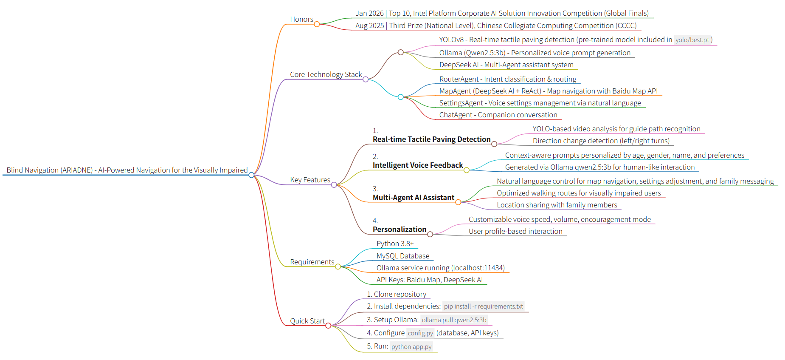

# Blind Navigation (ARIADNE) - Your Way Out of the Labyrinth

<div align="center">
  
  
  
[English](README.md) | [简体中文](README.zh-CN.md)

[](https://www.python.org/downloads/)
[](https://flask.palletsprojects.com/)
[](LICENSE)
[](https://github.com/wink-wink-wink555/blind_navigation/stargazers)

</div>

> 📹 Demo Video: https://www.bilibili.com/video/BV1kD57zGE68 (v1.0.0)

<div align="center">
  
</div>

<details>
<summary><strong>🏆 HONORS & AWARDS</strong></summary>

This project has received the following awards and accolades:

* **Jan 2026** | **Top 10**, Intel Platform Corporate AI Solution Innovation Practice Competition (Global Finals)
* **Dec 2025** | **Top 20**, Intel Platform Corporate AI Solution Innovation Practice Competition (Preliminary Round) — *Successfully advanced to the Global Finals*
* **Aug 2025** | **Third Prize (National Level)**, Chinese Collegiate Computing Competition (CCCC)
* **May 2025** | **First Prize (Provincial Level)**, Shanghai Computer Application Competence Competition for College Students

</details>

---

## 🌟 Introduction

Travel Assistance System for the Visually Impaired (ARIADNE) is an innovative AI-powered navigation system designed for visually impaired individuals. It combines computer vision and artificial intelligence to identify tactile paving (guide paths) through real-time video analysis and provides intelligent voice guidance. The system also features a built-in **Multi-Agent AI Assistant** — users can simply speak naturally to complete map navigation, adjust system settings, send messages to family members, and more. Additional features include real-time location sharing to enhance travel safety and independence.

### Tech Stack

- **Frontend**: HTML5, CSS3, Vanilla JavaScript
- **Backend**: Flask (Python 3.8+)
- **AI Models**:
  - YOLO (You Only Look Once) - Tactile paving detection
  - Ollama (Qwen2.5:3b) - Personalized voice prompt generation
  - DeepSeek AI - Multi-Agent assistant (intent routing, map navigation, settings management, companion chat)
- **Multi-Agent Architecture**:
  - RouterAgent - Intent classification & routing
  - MapAgent (DeepSeekAI + ReAct) - Map navigation agent
  - SettingsAgent - Settings query & modification agent
  - ChatAgent - Companion chat agent
- **Database**: MySQL
- **Third-party Services**:
  - Baidu Map API - Location services and route planning
  - Edge TTS / pyttsx3 - Text-to-speech synthesis

## 🎯 Problems Solved

This system addresses the following challenges:

1. **Tactile Paving Recognition & Navigation**: Real-time video analysis to identify tactile paving position and direction changes, helping visually impaired individuals walk safely

2. **Real-time Voice Feedback**: Automatically provides personalized AI voice prompts when tactile paving direction changes are detected

3. **Multi-Agent AI Assistant**: A unified intent routing + multi-agent dispatch architecture that enables natural language interaction for map navigation, system settings modification, family messaging, and companion conversation

4. **Safety Monitoring**: Location sharing allows family members to remotely view the location of visually impaired individuals

5. **Personalized Experience**: Customizable voice speed, volume, address preferences, and other parameters

6. **Accessibility Design**: Reduces barriers for visually impaired individuals to use modern urban facilities

## ✨ Key Features

- 🎥 **Real-time Video Analysis**: Uses YOLO model for real-time tactile paving detection
- 🔊 **Intelligent Voice Feedback**: Uses Ollama (qwen2.5:3b) to generate personalized, context-aware voice prompts based on user profile (age, gender, name, preferences)
- 🤖 **Multi-Agent AI Assistant**: A DeepSeek AI-powered multi-agent system — users simply speak naturally to:
  - 🗺️ **Map Navigation**: Location queries, walking route planning (optimized for the visually impaired), and nearby place search
  - ⚙️ **Voice Settings**: Query or modify voice speed, volume, encouragement mode, and all other system settings via natural language
  - 📨 **Family Messaging**: Send location or status messages to family members in one sentence
  - 💬 **Companion Chat**: Warm conversational companion to ease the loneliness of travel
- 👤 **User System**: Complete registration, login, and password recovery functionality
- 📍 **Location Sharing**: Real-time location sharing for family members
- ⚙️ **Personalized Settings**: Customizable voice speed, volume, gender, age group, address preferences, etc.
- 🎯 **Dual Mode**: Supports both visually impaired user mode and family member mode

<details>
<summary><strong>How Ollama Powers Navigation</strong></summary>

When the system detects a change in tactile paving direction (left or right turn), it uses the Ollama qwen2.5:3b model to generate natural, personalized voice prompts. The AI considers:
- User's preferred name or nickname
- Age group (youth/middle-aged/senior) for appropriate tone
- Gender for voice selection
- Encouragement settings to provide motivational feedback
- Previous context to avoid repetitive messages

This creates a more human-like and engaging experience compared to static, pre-recorded messages.

</details>

<details>
<summary><strong>🤖 Multi-Agent Architecture</strong></summary>

The system features a unified multi-agent dispatch center (`/chat` endpoint). Users send a single message and the system automatically identifies the intent and routes it to the appropriate agent.

```
User Input
    │
    ▼
RouterAgent (Intent Classifier)
    │
    ├─ map      ──► MapAgent (DeepSeekAI + ReAct loop + Baidu Map MCP)
    │                  └─ Geocoding → Nearby search → Walking route → Natural language reply
    │
    ├─ settings ──► SettingsAgent (Query & Modify settings)
    │                  └─ Parse intent → Validate values → Write to DB → Sync Session
    │
    ├─ message  ──► Message Handler (Send message to family)
    │
    └─ chat     ──► ChatAgent (Warm companion chat with full context)
```

**Agent Responsibilities:**

| Agent | File | Responsibility |
|---|---|---|
| RouterAgent | `services/router_agent.py` | Classify intent and route to the correct agent |
| MapAgent | `services/deepseek_ai.py` | ReAct-loop map tools, walking navigation optimized for the visually impaired |
| SettingsAgent | `services/settings_agent.py` | Natural language settings query and modification, synced to DB and Session in real time |
| ChatAgent | `routes/chat.py` | Warm companion chat with full conversation context and user profile |

**Example Interactions:**
- `"Set my voice speed to slow"` → SettingsAgent adjusts voice speed
- `"How do I walk from Tiananmen Square to the National Museum?"` → MapAgent plans a walking route
- `"Send my family a message: I've arrived"` → Message handler notifies family
- `"What a nice day today"` → ChatAgent responds warmly

</details>

## 🎯 Pre-trained YOLO Model

This project includes a **fully trained YOLOv8 tactile paving detection model** with excellent performance:

- **Model Location**: `yolo/best.pt`
- **Training Results**: The `yolo/` folder contains comprehensive training metrics:
  - Confusion matrices (normalized and raw)
  - Precision-Recall curves
  - F1 score curves
  - Training results visualization

You can use this model directly without any additional training. The model has been trained on a custom tactile paving dataset and achieves high accuracy in detecting tactile paving patterns and direction changes.

## 📋 Requirements

- Python 3.8+
- MySQL Database
- Ollama with qwen2.5:3b model installed
- Required Python libraries (see installation steps below)

**Note**: This project includes a pre-trained YOLOv8 tactile paving detection model in the `yolo/` folder, so you don't need to train your own model!

## 🚀 Installation

<details>
<summary><strong>1. Clone Repository</strong></summary>

```bash
git clone https://github.com/wink-wink-wink555/blind_navigation.git
cd blind_navigation
```

</details>

<details>
<summary><strong>2. Create Virtual Environment (Recommended)</strong></summary>
  
```bash
# Create virtual environment
python -m venv venv

# Windows
venv\Scripts\activate

# Linux/Mac
source venv/bin/activate
```

</details>

<details>
<summary><strong>3. Install Dependencies</strong></summary>


```bash
pip install -r requirements.txt
```

Or install packages individually:

```bash
pip install flask pymysql ultralytics ollama numpy pyttsx3 geopy Pillow edge-tts requests opencv-python Werkzeug
```

</details>

<details>
<summary><strong>4. Install and Configure Ollama</strong></summary>


Install Ollama and pull the qwen2.5:3b model:

```bash
# Visit https://ollama.com/ to download and install Ollama for your OS

# After installation, pull the qwen2.5:3b model
ollama pull qwen2.5:3b

# Verify the model is installed
ollama list
```

Make sure Ollama service is running on `http://localhost:11434` (default port).

</details>

<details>
<summary><strong>5. Database Setup</strong></summary>

Create MySQL database:

```sql
CREATE DATABASE blind_navigation CHARACTER SET utf8mb4 COLLATE utf8mb4_unicode_ci;
```

The application will automatically create required tables on first run.

</details>

<details>
<summary><strong>6. Configuration</strong></summary>

Copy `config.example.py` to `config.py` and modify the configuration:

```bash
cp config.example.py config.py  # Linux/Mac
copy config.example.py config.py  # Windows
```

Then modify `config.py`:

- **Database Config** (`DB_CONFIG`): Set MySQL host, user, password, etc.
- **Email Config** (`EMAIL_CONFIG`): Configure QQ email SMTP service (for verification codes)
- **Baidu Map Config** (`BAIDU_MAP_CONFIG`): Set Baidu Map API key
- **DeepSeek AI Config** (`DEEPSEEK_CONFIG`): Set DeepSeek AI API key
- **YOLO Model Path** (`MODEL_WEIGHTS`): Set to `'yolo/best.pt'` (pre-trained model included)

Example configuration:
```python
# YOLO model configuration
MODEL_WEIGHTS = 'yolo/best.pt'  # Use the included pre-trained model
```
</details>

## 🏃 Running the Application

```bash
python app.py
```

The application will run at http://127.0.0.1:5000/

## 📖 Usage Guide

<details>
<summary><strong>1. Account Management</strong></summary>

#### Register Account
1. Visit system homepage and click "Register"
2. Fill in username, password, email, etc.
3. Click "Get Verification Code" - system will send code to your email
4. Enter received verification code to complete registration

#### Login
1. Enter username and password
2. Click "Login" to access the system
3. Click "Forgot Password" to reset if needed

</details>

<details>
<summary><strong>2. Tactile Paving Navigation</strong></summary>

#### Video Analysis
1. Click "Upload Video" and select video file for analysis
2. System automatically analyzes tactile paving in the video
3. Voice prompts play automatically when tactile paving direction changes are detected

#### Real-time Navigation
1. Mount your phone or tablet to ensure camera can capture the tactile paving ahead
2. Click "Start Navigation"
3. System analyzes camera feed in real-time and provides voice navigation guidance

</details>

<details>
<summary><strong>3. Multi-Agent AI Assistant</strong></summary>

The system has a unified AI chat interface that automatically identifies your intent and routes it to the appropriate agent — no need to switch screens.

#### Map Navigation
Simply ask in natural language:
- "What are the coordinates of Tiananmen Square?"
- "What convenience stores are near me?"
- "How do I walk from Beijing Railway Station to Tiananmen Square?"

The system calls map services and responds in a voice-friendly format. Route descriptions use relative directions (turn left / turn right / walk straight), specifically optimized for visually impaired users.

#### Voice Settings Control
Query or modify system settings naturally:
- "Set my voice speed to slow"
- "Turn the volume up a bit"
- "Turn off encouragement mode"
- "What is my current voice speed?"
- "What's my name in the system?"

The SettingsAgent automatically parses the intent, validates values, and updates settings in real time.

#### Send Message to Family
Just say what you want to send:
- "Send my family a message: I've arrived at school"
- "Let my family know I'm on the way"

#### Companion Chat
The built-in warm ChatAgent supports everyday conversation with full conversation memory, so you never feel alone on the road.

</details>

<details>
<summary><strong>4. Location Sharing</strong></summary>
  
#### Share Location
1. Click "Location Sharing" button on main interface
2. Authorize system to access location information
3. Select family member account to share with
4. Click "Start Sharing"

#### View Location
1. Login with family member account
2. Click "View Location" on main interface
3. System displays map interface with real-time location marker

</details>

<details>
<summary><strong>5. System Settings</strong></summary>
  
#### Personalized Settings
1. Click "Settings" button on main interface
2. Adjust the following parameters:
   - **Gender**: Male/Female/Not specified
   - **Name**: Set preferred name or how you'd like to be addressed
   - **Age Group**: Youth/Middle-aged/Senior/Not specified
   - **Voice Speed**: Slow/Medium/Fast
   - **Voice Volume**: Low/Medium/High
   - **User Mode**: Visually impaired user/Family member
   - **Encouragement**: On/Off (provides encouragement when appropriate)
3. Click "Test Voice" to preview
4. Click "Save Settings" to save changes

</details>

## ⚠️ Notes

- **Ollama service must be running** for personalized voice prompt generation
- **Multi-Agent AI Assistant** (map navigation, settings modification, companion chat, etc.) requires a valid DeepSeek AI API key
- Email configuration required for verification code functionality
- Model recognition quality depends on training data quality
- Ensure camera permissions are enabled when using camera
- Location sharing requires GPS permissions
- DeepSeek AI functionality requires valid API key
- Baidu Map functionality requires valid API key (used by the Map Navigation Agent)

## 📧 Contact

- **Email**: yfsun.jeff@gmail.com
- **GitHub**: [wink-wink-wink555](https://github.com/wink-wink-wink555)
- **LinkedIn**: [Yifei Sun](https://www.linkedin.com/in/yifei-sun-0bab66341/)
- **Bilibili**: [NO_Desire](https://space.bilibili.com/623490717)

## 🙏 Acknowledgments

Special thanks to the following members for their contributions to the collection and annotation of the tactile paving dataset, as well as the preparation of the project proposal.
- [Chen Xingyu](https://github.com/guangxiangdebizi)
- Wang Youyi
- Liu Yiheng
- Cai Yuxin
- Zhang Chenshu
- Zhang Kai
- Shen Qian
- Sheng sheng

## 📁 Project Structure

```
blind_navigation/
├── app.py                 # Flask application main file
├── config.py              # Configuration file
├── models/                # Database models
│   ├── __init__.py
│   └── database.py        # Database operations
├── routes/                # Route blueprints
│   ├── __init__.py
│   ├── auth.py           # Authentication routes
│   ├── chat.py           # Multi-Agent dispatch center (unified chat endpoint) ★New
│   ├── main.py           # Main page routes
│   ├── video.py          # Video processing routes
│   └── map.py            # Map-related routes
├── services/              # Business services
│   ├── __init__.py
│   ├── baidu_map_mcp.py  # Baidu Map MCP tool set
│   ├── deepseek_ai.py    # MapAgent (ReAct-mode map navigation)
│   ├── router_agent.py   # RouterAgent (intent classifier & router) ★New
│   └── settings_agent.py # SettingsAgent (settings query & modification) ★New
├── utils/                 # Utility functions
│   ├── __init__.py
│   ├── decorators.py     # Decorators
│   ├── email_utils.py    # Email utilities
│   ├── video_utils.py    # Video processing utilities
│   └── voice_utils.py    # Voice utilities
├── templates/             # HTML templates
│   ├── index.html
│   ├── login.html
│   ├── register.html
│   └── forget_password.html
├── uploads/              # Upload directory
└── yolo/                 # Pre-trained YOLO model
    ├── best.pt           # Model weights (ready to use!)
    ├── results.png       # Training results visualization
    ├── confusion_matrix.png
    └── ...               # Other training metrics
```

## 📄 License

This project is licensed under the [MIT License](LICENSE).

Copyright (c) 2025 wink-wink-wink555

You are free to use, modify, and distribute this software for personal or commercial purposes, provided that the copyright notice and permission notice are included in all copies.

For detailed terms, please refer to the [LICENSE](LICENSE) file.

---


⭐ If this project helps you, please give it a star!
