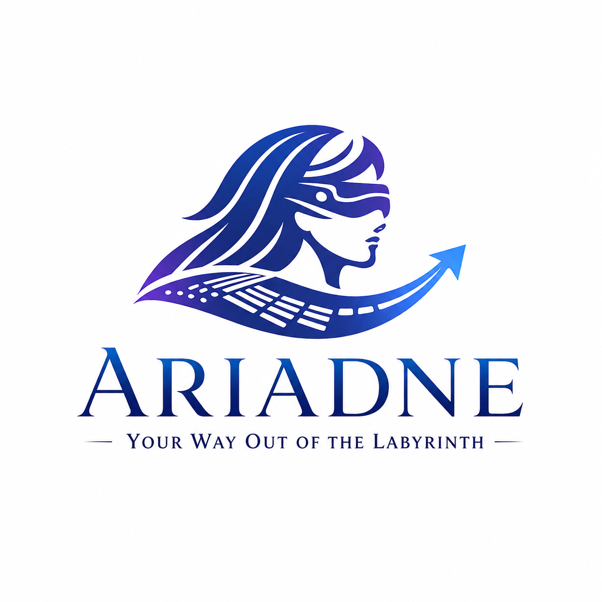

# Blind Navigation (ARIADNE) - 引君出迷津

<div align="center">



[English](README.md) | [简体中文](README.zh-CN.md)

[](https://www.python.org/downloads/)
[](https://flask.palletsprojects.com/)
[](LICENSE)
[](https://github.com/wink-wink-wink555/blind_navigation/stargazers)

</div>

> 📹 演示视频：https://www.bilibili.com/video/BV1kD57zGE68 (v1.0.0)

<details>
<summary><strong>🏆 荣誉与奖项</strong></summary>

本项目已获得以下竞赛奖项与认可：

- **2026.1** 英特尔平台企业AI解决方案创新实践赛决赛 — 10强
- **2025.12** 英特尔平台企业AI解决方案创新实践赛 — 20强，*成功晋级决赛*
- **2025.8** 中国大学生计算机设计大赛 — 国家级三等奖  
- **2025.5** 上海市大学生计算机应用能力大赛 — 省级一等奖  

</details>

---

## 🌟 项目简介

视障人士出行辅助系统 (ARIADNE) 是一个结合计算机视觉和人工智能的创新应用，专为视障人士设计。系统通过实时视频分析技术识别盲道方向变化，并通过个性化的AI语音提示引导视障人士正确沿盲道行走。同时，系统还内置了一套**多Agent智能助手**，用户只需用自然语言说话，即可完成地图导航、系统设置修改、给家属发消息等操作，并提供位置共享功能，让家属能够随时了解视障人士的位置，提高出行安全性。

### 核心技术栈

- **前端**：HTML5, CSS3, JavaScript (原生)
- **后端**：Flask (Python 3.8+)
- **AI模型**：
  - YOLO (You Only Look Once) - 盲道检测
  - Ollama (Qwen2.5:3b) - 个性化语音提示生成
  - DeepSeek AI - 多Agent智能助手（意图路由、地图导航、设置管理、闲聊陪伴）
- **多Agent架构**：
  - RouterAgent - 意图分类路由器
  - MapAgent (DeepSeekAI + ReAct) - 地图导航Agent
  - SettingsAgent - 设置查询/修改Agent
  - ChatAgent - 闲聊陪伴Agent
- **数据库**：MySQL
- **第三方服务**：
  - 百度地图 API - 位置服务和路线规划
  - Edge TTS / pyttsx3 - 语音合成

## 🎯 解决的问题

本系统主要解决以下问题：

1. **盲道识别与导航**：通过实时视频分析，识别盲道的位置和方向变化，帮助视障人士安全地沿盲道行走

2. **实时语音反馈**：检测到盲道方向变化时，自动提供个性化的AI语音提示，让视障人士及时调整行进方向

3. **多Agent智能助手**：采用意图路由 + 多Agent调度架构，支持自然语言交互完成地图导航、系统设置修改、给家属发消息及日常闲聊等多种任务

4. **安全监护**：通过位置共享功能，家属可以远程查看视障人士的位置，及时提供帮助

5. **个性化体验**：支持自定义语音速度、音量、称呼等参数，满足不同用户的需求

6. **无障碍设计**：降低视障人士使用现代城市设施的门槛，提高生活自理能力和出行便利性

## ✨ 功能亮点

- 🎥 **实时视频分析**：使用YOLO模型实时识别盲道
- 🔊 **智能语音反馈**：使用Ollama (qwen2.5:3b) 根据用户资料（年龄、性别、称呼、偏好）生成个性化、情境感知的语音提示
- 🤖 **多Agent智能助手**：基于 DeepSeek AI 构建的多Agent系统，用户用自然语言即可完成：
  - 🗺️ **地图导航**：位置查询、路线规划（仅步行，专为视障设计）、周边搜索
  - ⚙️ **语音设置**：自然语言修改/查询语音速度、音量、鼓励功能等所有系统设置
  - 📨 **家属消息**：一句话即可给家属发送位置或状态消息
  - 💬 **闲聊陪伴**：温暖陪伴，缓解出行孤独感
- 👤 **用户系统**：包含注册、登录、密码找回等完整功能
- 📍 **位置共享**：支持实时位置共享，方便家属了解视障人士位置
- ⚙️ **个性化设置**：可自定义语音速度、音量、性别、年龄段、称呼等参数
- 🎯 **双端模式**：支持盲人端和家属端两种模式切换

<details>
<summary><strong>Ollama 如何驱动导航</strong></summary>

当系统检测到盲道方向变化（左转或右转）时，会使用 Ollama qwen2.5:3b 模型生成自然、个性化的语音提示。AI 会考虑：
- 用户的偏好称呼或昵称
- 年龄段（青年/中年/老年）以使用适当的语气
- 性别用于语音选择
- 鼓励设置，在适当时提供激励性反馈
- 上下文信息，避免重复性消息

这创造了比静态预录音消息更加人性化和有吸引力的体验。

</details>

<details>
<summary><strong>🤖 多Agent智能助手架构</strong></summary>

系统新增了一套统一的多Agent调度中心（`/chat` 接口），用户只需说一句话，系统自动判断意图并派发给对应的Agent处理。

```
用户输入
    │
    ▼
RouterAgent（意图分类器）
    │
    ├─ map      ──► MapAgent（DeepSeekAI + ReAct循环 + 百度地图MCP）
    │                  └─ 地址解析 → 周边搜索 → 步行路线规划 → 自然语言回答
    │
    ├─ settings ──► SettingsAgent（设置查询 & 修改）
    │                  └─ 理解意图 → 校验字段值 → 写入数据库 → 同步Session
    │
    ├─ message  ──► 消息处理器（给家属发消息）
    │
    └─ chat     ──► ChatAgent（温暖闲聊，带完整上下文）
```

**各Agent职责：**

| Agent | 文件 | 功能 |
|---|---|---|
| RouterAgent | `services/router_agent.py` | 意图分类，将消息路由到正确的Agent |
| MapAgent | `services/deepseek_ai.py` | ReAct 模式迭代调用地图工具，专为视障步行导航优化 |
| SettingsAgent | `services/settings_agent.py` | 自然语言查询和修改系统设置，实时同步数据库与Session |
| ChatAgent | `routes/chat.py` | 温暖陪伴式闲聊，带完整对话上下文和用户画像 |

**示例对话：**
- `"帮我把语音速度调成慢"` → SettingsAgent 修改语音速度
- `"从上海人民广场到上海博物馆怎么走？"` → MapAgent 规划步行路线
- `"给家属说一声我在路上"` → 消息处理器发送家属消息
- `"今天天气真好"` → ChatAgent 温暖回应

</details>

## 🎯 预训练YOLO模型

本项目包含了一个**效果完美的YOLOv8盲道检测模型**：

- **模型位置**：`yolo/best.pt`
- **训练结果**：`yolo/` 文件夹包含了完整的训练指标：
  - 混淆矩阵（归一化和原始）
  - 精确率-召回率曲线
  - F1分数曲线
  - 训练结果可视化

您可以直接使用这个模型，无需进行任何额外的训练。该模型在自定义盲道数据集上训练，在检测盲道图案和方向变化方面具有很高的准确性。

## 📋 环境要求

- Python 3.8+
- MySQL 数据库
- Ollama 及 qwen2.5:3b 模型
- 必要的Python库（见下方安装步骤）

**注意**：本项目在 `yolo/` 文件夹中包含了已训练好的YOLOv8盲道检测模型，您无需自己训练模型！

## 🚀 安装步骤

<details>
<summary><strong>1. 克隆仓库</strong></summary>

```bash
git clone https://github.com/wink-wink-wink555/blind_navigation.git
cd blind_navigation
```

</details>

<details>
<summary><strong>2. 创建并激活虚拟环境（推荐）</strong></summary>

```bash
# 创建虚拟环境
python -m venv venv

# Windows
venv\Scripts\activate

# Linux/Mac
source venv/bin/activate
```

</details>

<details>
<summary><strong>3. 安装依赖</strong></summary>

```bash
pip install -r requirements.txt
```

或单独安装各个包：

```bash
pip install flask pymysql ultralytics ollama numpy pyttsx3 geopy Pillow edge-tts requests opencv-python Werkzeug
```

</details>

<details>
<summary><strong>4. 安装并配置 Ollama</strong></summary>

安装 Ollama 并拉取 qwen2.5:3b 模型：

```bash
# 访问 https://ollama.com/ 下载并安装适合您操作系统的 Ollama

# 安装完成后，拉取 qwen2.5:3b 模型
ollama pull qwen2.5:3b

# 验证模型已安装
ollama list
```

确保 Ollama 服务运行在 `http://localhost:11434`（默认端口）。

</details>

<details>
<summary><strong>5. 配置数据库</strong></summary>

创建MySQL数据库：

```sql
CREATE DATABASE blind_navigation CHARACTER SET utf8mb4 COLLATE utf8mb4_unicode_ci;
```

应用会在首次运行时自动创建所需的数据表。

</details>

<details>
<summary><strong>6. 配置文件</strong></summary>

将 `config.example.py` 复制为 `config.py` 并修改配置：

```bash
cp config.example.py config.py  # Linux/Mac
copy config.example.py config.py  # Windows
```

然后修改 `config.py` 中的配置：

- **数据库配置** (`DB_CONFIG`)：设置MySQL的host、user、password等
- **邮件配置** (`EMAIL_CONFIG`)：配置QQ邮箱的SMTP服务（用于验证码发送）
- **百度地图配置** (`BAIDU_MAP_CONFIG`)：设置百度地图API密钥
- **DeepSeek AI配置** (`DEEPSEEK_CONFIG`)：设置DeepSeek AI的API密钥
- **YOLO模型路径** (`MODEL_WEIGHTS`)：设置为 `'yolo/best.pt'`（使用项目包含的预训练模型）

配置示例：
```python
# YOLO模型配置
MODEL_WEIGHTS = 'yolo/best.pt'  # 使用项目包含的预训练模型
```
</details>

## 🏃 运行应用

```bash
python app.py
```

应用将运行在 http://127.0.0.1:5000/

## 📖 使用说明

<details>
<summary><strong>1. 账户管理</strong></summary>

#### 注册账户
1. 访问系统首页，点击"注册"按钮
2. 填写用户名、密码、邮箱等信息
3. 点击"获取验证码"按钮，系统会向您的邮箱发送验证码
4. 输入收到的验证码，完成注册

#### 登录系统
1. 输入用户名和密码
2. 点击"登录"按钮进入系统
3. 如忘记密码，可点击"忘记密码"进行重置

</details>

<details>
<summary><strong>2. 盲道导航</strong></summary>

#### 视频分析
1. 点击"上传视频"按钮，选择待分析的视频文件
2. 系统会自动开始分析视频中的盲道
3. 当检测到盲道方向变化时，系统会自动播放语音提示

#### 实时导航
1. 将手机或平板设备固定在适当位置，确保摄像头可以拍摄到前方的盲道
2. 点击"开始导航"按钮
3. 系统会实时分析摄像头画面，提供语音导航指引

</details>

<details>
<summary><strong>3. 多Agent智能助手</strong></summary>

系统内置统一的AI对话入口，自动识别您的意图并派发给对应的专属Agent处理，无需切换界面。

#### 地图导航
在对话框中直接用自然语言提问，例如：
- "天安门广场的坐标是多少？"
- "我附近有什么便利店？"
- "从北京站到天安门广场怎么走？"

系统会调用地图服务并以适合语音播报的方式回答，路线描述使用相对方向（左转/右转/向前走），专为视障人士优化。

#### 设置语音控制
直接用自然语言查询或修改系统设置，例如：
- "帮我把语音速度调成慢"
- "把音量调大一点"
- "关闭鼓励功能"
- "现在语音速度是多少？"
- "我叫什么名字？"

SettingsAgent 会自动解析意图、校验参数并实时更新设置。

#### 给家属发消息
直接说出要发送的内容，例如：
- "帮我发给家属消息：我已经到学校了"
- "给家属说一声我在路上"

#### 日常闲聊
系统内置温暖的陪伴式 ChatAgent，支持日常对话，带完整对话上下文记忆，让出行不孤单。

</details>

<details>
<summary><strong>4. 位置共享</strong></summary>
  
#### 分享位置
1. 在主界面点击"位置共享"按钮
2. 授权系统访问位置信息
3. 选择要分享给的家属账号
4. 点击"开始分享"按钮

#### 查看位置
1. 使用家属账号登录系统
2. 在主界面点击"查看位置"按钮
3. 系统会显示地图界面，标注视障人士的实时位置

</details>

<details>
<summary><strong>5. 系统设置</strong></summary>
  
#### 个性化设置
1. 点击主界面的"设置"按钮
2. 可调整以下参数：
   - **性别**：男/女/未指定
   - **称呼**：设置您希望被称呼的名字或昵称
   - **年龄段**：青年/中年/老年/未指定
   - **语音速度**：慢/中等/快
   - **语音音量**：低/中等/高
   - **用户模式**：盲人端/家属端
   - **鼓励功能**：开/关（适当时给予鼓励）
3. 点击"测试语音"按钮预览效果
4. 点击"保存设置"按钮保存更改

</details>

## ⚠️ 注意事项

- **Ollama 服务必须运行** 才能实现个性化语音提示生成功能
- **多Agent智能助手**（地图导航、设置修改、闲聊等）依赖 DeepSeek AI API，请确保配置了有效的 API 密钥
- 系统需要配置邮箱才能支持验证码功能
- 模型识别效果取决于训练数据的质量
- 使用摄像头时请确保已开启相机权限
- 位置共享功能需要开启GPS权限
- DeepSeek AI功能需要有效的API密钥
- 百度地图功能需要有效的API密钥（地图导航Agent使用）

## 📧 联系方式

- **Email**: yfsun.jeff@gmail.com
- **GitHub**: [wink-wink-wink555](https://github.com/wink-wink-wink555)
- **LinkedIn**: [Yifei Sun](https://www.linkedin.com/in/yifei-sun-0bab66341/)
- **Bilibili**: [NO_Desire](https://space.bilibili.com/623490717)

## 🙏 特别感谢

特别感谢以下成员在盲道数据集收集、标注与项目书撰写等工作中提供的帮助：
- [Chen Xingyu](https://github.com/guangxiangdebizi)
- Wang Youyi
- Liu Yiheng
- Cai Yuxin
- Zhang Chenshu
- Zhang Kai
- Shen Qian
- Sheng sheng

## 📁 项目结构

```
blind_navigation/
├── app.py                 # Flask应用主文件
├── config.py              # 配置文件
├── models/                # 数据库模型
│   ├── __init__.py
│   └── database.py        # 数据库操作
├── routes/                # 路由蓝图
│   ├── __init__.py
│   ├── auth.py           # 认证相关路由
│   ├── chat.py           # 多Agent调度中心（统一聊天入口）★新增
│   ├── main.py           # 主页面路由
│   ├── video.py          # 视频处理路由
│   └── map.py            # 地图相关路由
├── services/              # 业务服务
│   ├── __init__.py
│   ├── baidu_map_mcp.py  # 百度地图MCP工具集
│   ├── deepseek_ai.py    # MapAgent（ReAct模式地图导航）
│   ├── router_agent.py   # RouterAgent（意图分类路由器）★新增
│   └── settings_agent.py # SettingsAgent（设置查询/修改）★新增
├── utils/                 # 工具函数
│   ├── __init__.py
│   ├── decorators.py     # 装饰器
│   ├── email_utils.py    # 邮件工具
│   ├── video_utils.py    # 视频处理工具
│   └── voice_utils.py    # 语音工具
├── templates/             # HTML模板
│   ├── index.html
│   ├── login.html
│   ├── register.html
│   └── forget_password.html
├── uploads/              # 上传文件目录
└── yolo/                 # 预训练YOLO模型
    ├── best.pt           # 模型权重（开箱即用！）
    ├── results.png       # 训练结果可视化
    ├── confusion_matrix.png  # 混淆矩阵
    └── ...               # 其他训练指标
```

## 📄 开源协议

本项目采用 [MIT License](LICENSE) 开源协议。

Copyright (c) 2025 wink-wink-wink555

您可以自由地使用、修改和分发本软件，无论是个人用途还是商业用途，只需在所有副本中包含上述版权声明和许可声明即可。

详细条款请参阅 [LICENSE](LICENSE) 文件。

---

⭐ 如果这个项目对您有帮助，欢迎给个Star！
